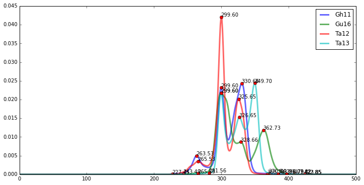

Quatre variantes d'un chant de femmes du sud-est tunisien
=========================================================

.. code:: python

    from music22 import modalis,scale
    path = "/Users/anas/AUDIO/quatre_chants/"
    Kchants = modalis.melodies(path,'Yes',300)

.. parsed-literal::

    Reading the content of : /Users/anas/AUDIO/quatre_chants/
    
    
    Instance created with the audio file : Gh11.wav
    Instance created with the txt file : Gh11.txt
    /Users/anas/AUDIO/quatre_chants/Gh11.wav appended
    Instance created with the audio file : Gh11.wav
    Instance created with the txt file : Gh11.txt
    Instance created with the audio file : Gu16.wav
    Instance created with the txt file : Gu16.txt
    /Users/anas/AUDIO/quatre_chants/Gu16.wav appended
    Instance created with the audio file : Gu16.wav
    Instance created with the txt file : Gu16.txt
    Instance created with the audio file : Ta12.wav
    Instance created with the txt file : Ta12.txt
    /Users/anas/AUDIO/quatre_chants/Ta12.wav appended
    Instance created with the audio file : Ta12.wav
    Instance created with the txt file : Ta12.txt
    Instance created with the audio file : Ta13.wav
    Instance created with the txt file : Ta13.txt
    /Users/anas/AUDIO/quatre_chants/Ta13.wav appended
    Instance created with the audio file : Ta13.wav
    Instance created with the txt file : Ta13.txt
    
    

Écoute des versions
-------------------

.. raw:: html

    <iframe width='815' height='255' frameborder='0' scrolling='no' marginheight='0' marginwidth='0' src='http://phonotheque.cmam.tn/archives/items/femmes_ghomrassen_2007_11/player/800x170'></iframe>

.. raw:: html

    <iframe width='815' height='255' frameborder='0' scrolling='no' marginheight='0' marginwidth='0' src='http://phonotheque.cmam.tn/archives/items/femmes_guermessa_16/player/800x170'></iframe>

.. raw:: html

    <iframe width='815' height='255' frameborder='0' scrolling='no' marginheight='0' marginwidth='0' src='http://phonotheque.cmam.tn/archives/items/femmes_tataouine_012/player/800x170'></iframe>

.. raw:: html

    <iframe width='815' height='255' frameborder='0' scrolling='no' marginheight='0' marginwidth='0' src='http://phonotheque.cmam.tn/archives/items/femmes_tataouine_013/player/800x170'></iframe>

|

Analyse et affichage des PDF-s
------------------------------

.. code:: python

    Kchants.pdf_show()

Transposition des fréquences
----------------------------

.. code:: python

    scale.set_xrange(200,450)

.. code:: python

    Kchants.pdf_show()

.. image:: quatre_chants_files/quatre_chants_11_0.png

Matrice des distances et groupement hiérarchique
------------------------------------------------

.. code:: python

    Kchants.matrix()

.. image:: quatre_chants_files/quatre_chants_13_0.png

Extraction des échelles
-----------------------

.. code:: python

    Kchants.melodies[0].name

.. parsed-literal::

    'Gh11'

.. code:: python

    Kchants.melodies[0].scale

.. parsed-literal::

    [('330.661322645', ('37.55', '12/11', '-', '0.24')),
     ('299.599198397', ('-5.29', '1/1', '-', '5.29')),
     ('263.527054108', ('-61.01', '9/8', '-', '9.85')),
     ('370.741482966', ('87.24', '9/8*12/11', '-', '1.70')),
     ('407.815631263', ('128.63', '4/3', '+', '3.69')),
     ('396.793587174', ('116.73', '4/3', '-', '8.21'))]

.. code:: python

    Kchants.melodies[1].name

.. parsed-literal::

    'Gu16'

.. code:: python

    Kchants.melodies[1].scale

.. parsed-literal::

    [('299.599198397', ('11.97', '1/1', '+', '11.97')),
     ('362.725450902', ('95.01', '5/4', '-', '1.90')),
     ('328.657314629', ('52.17', '9/8', '+', '1.02')),
     ('243.486973948', ('-78.09', '6/5', '-', '1.09')),
     ('422.845691383', ('161.61', '3/2', '-', '14.48'))]

.. code:: python

    Kchants.melodies[2].name

.. parsed-literal::

    'Ta12'

.. code:: python

    Kchants.melodies[2].scale

.. parsed-literal::

    [('299.599198397', ('-46.97', '10/9', '-', '1.21')),
     ('325.651302605', ('-10.75', '1/1', '-', '10.75')),
     ('265.531062124', ('-99.39', '5/4', '-', '2.48')),
     ('368.73747495', ('43.21', '10/9', '-', '2.55')),
     ('227.45490982', ('-166.61', '3/2', '-', '9.48')),
     ('423.847695391', ('103.70', '5/4', '+', '6.79'))]

.. code:: python

    Kchants.melodies[3].name

.. parsed-literal::

    'Ta13'

.. code:: python

    Kchants.melodies[3].scale

.. parsed-literal::

    [('349.699398798', ('67.73', '6/5', '-', '11.45')),
     ('299.599198397', ('0.58', '1/1', '+', '0.58')),
     ('326.653306613', ('38.13', '12/11', '+', '0.34')),
     ('281.563126253', ('-26.38', '12/11', '-', '11.40')),
     ('265.531062124', ('-51.85', '9/8', '-', '0.69')),
     ('383.76753507', ('108.11', '5/4', '+', '11.20')),
     ('396.793587174', ('122.60', '4/3', '-', '2.33'))]

