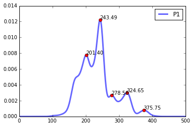

*Qaṣīda/Ibtihāl* par ʿAlī al-Barrāq (1891-1981, Kairouan)
=========================================================

*Les commandes ci-dessous sont une introduction à l'utilisation pratique
du package Music22 (v. 0.0.2). Il s'adresse à des utilisateurs sans
connaissance préalable de la programmation, mais qui ont pris
connaissance des premières étapes de l'utilisation de Python et on
installé le package Music22.*

*L'explication musicologique et les commentaires liées à cette méthode
d'analyse ont été présentés lors de la rencontre sur les maqām-s et
ṭubūʿ-s qui a eu lieu à l'université du Kaslik (Liban) le 19 juillet
2015. Le texte de la présentation (en arabe) est en cours de
publication.*

L'enregistrement a été publié dans le premier volume de l'Initiation à
la Musique Tunisienne (Snoussi, 1963/R-2003).

.. raw:: html

   <!--
   @book{snoussi_initiation_2003,
       title = {Initiation a la musique tunisienne: {Musique} classique},
       shorttitle = {Initiation a la musique tunisienne},
       language = {fr},
       publisher = {Centre des Musiques Arabes et Méditerranéennes Ennejma Ezzahra},
       author = {Snoussi, Manoubi},
       year = {2003},
       keywords = {Tunisie, Musique, CMAM, Snoussi}
   }
   -->

--------------

On se propose d'analyser un poème soufi (*qaṣidā : ʿomrī ʿalayka
tašawwuqan qaḍḍaytuhu*), interprété par ʿAlī al-Barrāq. Son fichier
sonore P0.wav se trouve dans le dossier ayant pour chemin (*path*)
/Users/anas/AUDIO/Barraq/. il est segmenté en six fichiers
(P1.wav-P6.wav) placés également dans le même dossier.

Nous procédons comme suit :

-  Commandes préliminaires
-  Écoute des des phrases segmentées
-  Commandes pour l'analyse d'une seule mélodie (la première phrase)
-  Commandes pour l'analyse et la comparaison de plusieurs phrases (les
   six phrases qui composent l'extrait)

Importation du module *modalis*
-------------------------------

.. code:: python

    import music22.modalis

Le commandes suivantes ne sont nécessaires que lors de l'utilisation
d'un notebook IPython/Jupyter (https://jupyter.org/)

.. code:: python

    # Pour que l'affichage des graphiques s'effectue dans le Notebook.
    %matplotlib inline
    
    # Pour intégrer du code html au notebook.
    # Il nous sert ici à intégrer (avec la balise <iframe>) des fichiers sonores placés dans une base de données sonores Telemeta.
    from IPython.display import HTML

Écoute de la totalité de l'enregistrement segmenté en six phrases
-----------------------------------------------------------------

La segmentation du fichier a été réalisée manuellement (avec un logiciel
d'édition sonore) en six phrases :

.. raw:: html

   

.. raw:: html

   <ul>

.. raw:: html

   <li>

عُمْرِي عَلَيْكَ تَشَـوُّقًا قَضَّيْتُهُ وَعَزِيزُ صَبْرِي فِي هَوَاكَ
أَهَنْتُهُ

.. raw:: html

   </li>

.. raw:: html

   </ul>

.. raw:: html

   

.. code:: python

    %%html
    
    <iframe width='815' height='300' frameborder='0' scrolling='no' marginheight='0' marginwidth='0'
    src='http://phonotheque.cmam.tn/archives/items/barraq_ibtihal_01/player/800x170'>
    </iframe>

.. raw:: html

    
    <iframe width='815' height='300' frameborder='0' scrolling='no' marginheight='0' marginwidth='0'
    src='http://phonotheque.cmam.tn/archives/items/barraq_ibtihal_01/player/800x170'>
    </iframe>

.. raw:: html

   

.. raw:: html

   <ul>

.. raw:: html

   <li>

وَجَعَلْتُ أَبْذُلُ فِيكَ دُرَّ مَدَامِعِي حَتَّى افْتَقَرْتُ إِلَى
العَقِيقِ بَذَلْتُهُ

.. raw:: html

   </li>

.. raw:: html

   </ul>

.. raw:: html

   

.. code:: python

    %%html
    <iframe width='815' height='300' frameborder='0' scrolling='no' marginheight='0' marginwidth='0'
    src='http://phonotheque.cmam.tn/archives/items/barraq_ibtihal_02/player/800x170'>
    </iframe>

.. raw:: html

    <iframe width='815' height='300' frameborder='0' scrolling='no' marginheight='0' marginwidth='0'
    src='http://phonotheque.cmam.tn/archives/items/barraq_ibtihal_02/player/800x170'>
    </iframe>

.. raw:: html

   

.. raw:: html

   <ul>

.. raw:: html

   <li>

وَجَعَلْتُ أَبْذُلُ فِيكَ دُرَّ مَدَامِعِي حَتَّى افْتَقَرْتُ إِلَى
العَقِيقِ بَذَلْتُهُ

.. raw:: html

   </li>

.. raw:: html

   </ul>

.. raw:: html

   

.. code:: python

    %%html
    <iframe width='815' height='300' frameborder='0' scrolling='no' marginheight='0' marginwidth='0'
    src='http://phonotheque.cmam.tn/archives/items/barraq_ibtihal_03/player/800x170'>
    </iframe>

.. raw:: html

    <iframe width='815' height='300' frameborder='0' scrolling='no' marginheight='0' marginwidth='0'
    src='http://phonotheque.cmam.tn/archives/items/barraq_ibtihal_03/player/800x170'>
    </iframe>

.. raw:: html

   

.. raw:: html

   <ul>

.. raw:: html

   <li>

قَـلْبِي الذِي لَا زَالَ فِيكَ مُتَيَّمًا لَوْ كَانَ يُنْزَعُ
بِاليَمِينِ لَنَزَعْتُهُ

.. raw:: html

   </li>

.. raw:: html

   </ul>

.. raw:: html

   

.. code:: python

    %%html
    <iframe width='815' height='300' frameborder='0' scrolling='no' marginheight='0' marginwidth='0'
    src='http://phonotheque.cmam.tn/archives/items/barraq_ibtihal_04/player/800x170'>
    </iframe>

.. raw:: html

    <iframe width='815' height='300' frameborder='0' scrolling='no' marginheight='0' marginwidth='0'
    src='http://phonotheque.cmam.tn/archives/items/barraq_ibtihal_04/player/800x170'>
    </iframe>

.. raw:: html

   

.. raw:: html

   <ul>

.. raw:: html

   <li>

قَـلْبِي الذِي لَا زَالَ فِيكَ مُتَيَّمًا لَوْ كَانَ يُنْزَعُ
بِاليَمِينِ لَنَزَعْتُهُ (بذلته)

.. raw:: html

   </li>

.. raw:: html

   </ul>

.. raw:: html

   

.. code:: python

    %%html
    <iframe width='815' height='300' frameborder='0' scrolling='no' marginheight='0' marginwidth='0'
    src='http://phonotheque.cmam.tn/archives/items/barraq_ibtihal_05/player/800x170'>
    </iframe>

.. raw:: html

    <iframe width='815' height='300' frameborder='0' scrolling='no' marginheight='0' marginwidth='0'
    src='http://phonotheque.cmam.tn/archives/items/barraq_ibtihal_05/player/800x170'>
    </iframe>

.. raw:: html

   

.. raw:: html

   <ul>

.. raw:: html

   <li>

لَوْ كُنْتَ تَنْهَانِي عَنِ المَاءِ الذِي فِيهِ حَيَاةُ النَّفْسِ مَا
سَوَّغْتُهُ

.. raw:: html

   </li>

.. raw:: html

   </ul>

.. raw:: html

   

.. code:: python

    %%html
    <iframe width='815' height='300' frameborder='0' scrolling='no' marginheight='0' marginwidth='0'
    src='http://phonotheque.cmam.tn/archives/items/barraq_ibtihal_06/player/800x170'>
    </iframe>

.. raw:: html

    <iframe width='815' height='300' frameborder='0' scrolling='no' marginheight='0' marginwidth='0'
    src='http://phonotheque.cmam.tn/archives/items/barraq_ibtihal_06/player/800x170'>
    </iframe>

Analyse de la première phrase
-----------------------------

Création de l'instance
~~~~~~~~~~~~~~~~~~~~~~

On procèdera premièrement par la création d'une instance (« objet ») que
nous nommons *barraq*. La création de l'instance se fait en indiquant le
*path* du fichier à la classe *melodia* du module *modalis* du package
*music22*.

.. code:: python

    path = "/Users/anas/AUDIO/Barraq/P1.wav"
    barraq = music22.modalis.melodia(path)

.. parsed-literal::

    Instance created with the audio file : P1.wav
    Instance created with the txt file : P1.txt

La création de l'instance analyse systématiquement les fréquences
fondamentales (voir la section analyse des fréquences fondamentales f0)
et les enregistre dans un fichier .txt.

Paramètres mélodiques principaux
~~~~~~~~~~~~~~~~~~~~~~~~~~~~~~~~

Avec la création de l'instance, certaines données sont automatiques
analysées. On peut les obtenir en faisant appels aux attributs de
l'instance :

.. code:: python

    barraq.xmin # la fréquence minimale, en Hertz

.. parsed-literal::

    99.712000000000003

.. code:: python

    barraq.xmax # la fréquence maximale

.. parsed-literal::

    410.53899999999999

.. code:: python

    barraq.mode # le mode : en termes statistiques, la fréquence la plus présente

.. parsed-literal::

    array([ 244.107])

.. code:: python

    barraq.tonique

.. parsed-literal::

    166.46600000000001

Pour plus de détails concernant l'analyse de la tonique, voir : ...

Dessiner la courbe mélodique
~~~~~~~~~~~~~~~~~~~~~~~~~~~~

Pour afficher la courbe mélodique, on peut utilise la méthode .plot().
La tonique détectée est automatiquement affichée. On peut juger
visuellement de la pertinance de la tonique détectée.

.. code:: python

    barraq.plot() # Les paranthèses sont nécessaires

Calculer et afficher la courbe PDF (Probability Density Function) avec ses pics
~~~~~~~~~~~~~~~~~~~~~~~~~~~~~~~~~~~~~~~~~~~~~~~~~~~~~~~~~~~~~~~~~~~~~~~~~~~~~~~

Pour afficher les fréquences les plus probables, on utilise la méthode
*.pdf\_show()*.

.. code:: python

    barraq.pdf_show() # Les parenthèses sont nécessaires.

Les valeurs de la PDF sont stockées dans l'attribut *barraq.pdf*

Obtenir l'échelle
~~~~~~~~~~~~~~~~~

Les données de l'échelle sont stockées dans l'attribut *.scale*.

.. code:: python

    barraq.scale

.. parsed-literal::

    [('243.486973948', ('165.15', '3/2', '-', '10.94')),
     ('201.402805611', ('82.74', '6/5', '+', '3.56')),
     ('324.649298597', ('290.09', '2/1', '-', '10.94')),
     ('278.557114228', ('223.59', '3/2*10/9', '+', '1.74')),
     ('375.751503006', ('353.58', '2/1*9/8', '+', '1.39'))]

Les fréquences sont indiquées par ordre d'importance (première colonne).
Ensuite sont indiquées : 1. les intervalles que forment ces fréquences
avec la tonique détectée (par défaut, en savart); 2. les intervalles
épimoriques les plus proches de cet intervalles, 3. sont-ils plus grand
ou plus petit que l'intervalle épimorique le plus proche ?; 4. La
distance qui les sépare (par défaut, en savart).

Par exemple, dans cette phrase, la fréquence la plus *probable* est la
fréquence 243 Hz. Elle forme avec la tonique l'intervalle 165.15
savarts. Cet intervalle est plus petit que l'intervalle épimorique le
plus proche 3/2 de 10.94 savarts.

On peut obtenir les intervalles en *cent*. Il suffit de modifier l'unité
de mesure en faisant appel au module *diastema* :

.. code:: python

    import music22.diastema
    music22.diastema.set_unit('cent')

.. parsed-literal::

    Unit is now set to : cent

Puis calculer l'échelle de nouveau avec la méthode *get\_scale()*, avant
d'appeler l'attribut *.scale*

.. code:: python

    barraq.get_scale()
    barraq.scale

.. parsed-literal::

    [('243.486973948', ('165.15', '3/2', '-', '10.94')),
     ('201.402805611', ('82.74', '6/5', '+', '3.56')),
     ('324.649298597', ('290.09', '2/1', '-', '10.94')),
     ('278.557114228', ('223.59', '3/2*10/9', '+', '1.74')),
     ('375.751503006', ('353.58', '2/1*9/8', '+', '1.39'))]

(BUG à corriger : en *cent* les signes + et moins - ne sont pas pris en
considération).

Dessiner la courbe mélodique en intégrant les intervalles calculés
~~~~~~~~~~~~~~~~~~~~~~~~~~~~~~~~~~~~~~~~~~~~~~~~~~~~~~~~~~~~~~~~~~

Pour dessiner la courbe mélodique en prenant en considération le calcule
des pics intervalliques et l'échelle, il suffit de fait de nouveau appel
à la méthode *.plot()* en indiquant l'argument *peaks="Yes"* :

.. code:: python

    music22.diastema.set_unit('savart')
    barraq.get_scale()
    barraq.plot(peaks="Yes")

.. parsed-literal::

    Unit is now set to : savart

Analyse et comparaison d'un ensemble de mélodies
------------------------------------------------

Création de l'instance
~~~~~~~~~~~~~~~~~~~~~~

La gestion de plusieurs mélodies/phrases s'effectue à travers la classe
*melodies* du module *modalis*.

.. code:: python

    path = "/Users/anas/AUDIO/Barraq/"
    Barraq = music22.modalis.melodies(path) # Création de l'instance _melodies_ du module modalis

.. parsed-literal::

    Reading the content of : /Users/anas/AUDIO/Barraq/
    
    
    Instance created with the audio file : P0.wav
    Instance created with the txt file : P0.txt
    /Users/anas/AUDIO/Barraq/P0.wav appended
    Instance created with the audio file : P0.wav
    Instance created with the txt file : P0.txt
    Instance created with the audio file : P1.wav
    Instance created with the txt file : P1.txt
    /Users/anas/AUDIO/Barraq/P1.wav appended
    Instance created with the audio file : P1.wav
    Instance created with the txt file : P1.txt
    Instance created with the audio file : P2.wav
    Instance created with the txt file : P2.txt
    /Users/anas/AUDIO/Barraq/P2.wav appended
    Instance created with the audio file : P2.wav
    Instance created with the txt file : P2.txt
    Instance created with the audio file : P3.wav
    Instance created with the txt file : P3.txt
    /Users/anas/AUDIO/Barraq/P3.wav appended
    Instance created with the audio file : P3.wav
    Instance created with the txt file : P3.txt
    Instance created with the audio file : P4.wav
    Instance created with the txt file : P4.txt
    /Users/anas/AUDIO/Barraq/P4.wav appended
    Instance created with the audio file : P4.wav
    Instance created with the txt file : P4.txt
    Instance created with the audio file : P5.wav
    Instance created with the txt file : P5.txt
    /Users/anas/AUDIO/Barraq/P5.wav appended
    Instance created with the audio file : P5.wav
    Instance created with the txt file : P5.txt
    Instance created with the audio file : P6.wav
    Instance created with the txt file : P6.txt
    /Users/anas/AUDIO/Barraq/P6.wav appended
    Instance created with the audio file : P6.wav
    Instance created with the txt file : P6.txt
    
    

Les fichiers contenant les fréquences fondamentales (.txt) sont stockés
dans un dossier f0 créé dans le dossier principal.

Affichage des courbes PDF-s
~~~~~~~~~~~~~~~~~~~~~~~~~~~

Afficher toutes les courbes PDF-s avec la méthode *.pdf\_show()* :

.. code:: python

    Barraq.pdf_show()

.. image:: barraq_files/barraq_60_0.png

Obtenir l'échelle d'une mélodie
~~~~~~~~~~~~~~~~~~~~~~~~~~~~~~~

On peut obtenir l'échelle d'une phrase en indiquant son numéro :

.. code:: python

    Barraq.melodies[2].scale

.. parsed-literal::

    [('241.482965932', ('187.95', '3/2', '+', '11.86')),
     ('201.402805611', ('109.13', '5/4', '+', '12.22')),
     ('301.603206413', ('284.50', '3/2*5/4', '+', '11.50')),
     ('321.643286573', ('312.44', '2/1', '+', '11.41')),
     ('279.559118236', ('251.53', '3/2*6/5', '-', '3.74')),
     ('364.729458918', ('367.03', '2/1*6/5', '-', '13.18'))]

Dessiner une ligne mélodie avec l'échelle calculée
~~~~~~~~~~~~~~~~~~~~~~~~~~~~~~~~~~~~~~~~~~~~~~~~~~

et afficher sa courbe mélodique :

.. code:: python

    Barraq.melodies[5].plot(peaks="Yes")

Matrice des distances / classement hiérarchique
~~~~~~~~~~~~~~~~~~~~~~~~~~~~~~~~~~~~~~~~~~~~~~~

La méthode *.matrix()* donne la matice des similarités et le classement
hiérarchique :

.. code:: python

    Barraq.matrix()

On peut lire que la phrase P3 est la plus éloignée des autres phrases et
plus particulièrement de la phrase P4. La phrase qui contient les
caractétistiques proches de l'ensemble du fichier (P0) est la phrase P2.
