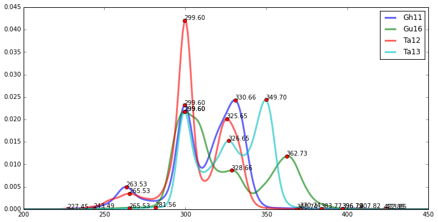

Quatre variantes d'un chant de femmes du sud-est tunisien
=========================================================

Contrairement à l'exemple précédent, il s'agira ici de comparer les
centres fréquentiels de mélodies chantées par des personnes différentes.
Il faudra donc procéder en premier lieu à la transposition des
fréquences sur une même fréquence :

.. code:: python

    from music22.modalis import melodies
    
    path = "/Users/anas/AUDIO/quatre_chants/"
    Kchants = melodies(path,transpose='Yes',freqref=300)

.. parsed-literal::

    Reading the content of : /Users/anas/AUDIO/quatre_chants/
    
    
    Instance created with the audio file : Gh11.wav
    Instance created with the txt file : Gh11.txt
    /Users/anas/AUDIO/quatre_chants/Gh11.wav appended
    Instance created with the audio file : Gh11.wav
    Instance created with the txt file : Gh11.txt
    Instance created with the audio file : Gu16.wav
    Instance created with the txt file : Gu16.txt
    /Users/anas/AUDIO/quatre_chants/Gu16.wav appended
    Instance created with the audio file : Gu16.wav
    Instance created with the txt file : Gu16.txt
    Instance created with the audio file : Ta12.wav
    Instance created with the txt file : Ta12.txt
    /Users/anas/AUDIO/quatre_chants/Ta12.wav appended
    Instance created with the audio file : Ta12.wav
    Instance created with the txt file : Ta12.txt
    Instance created with the audio file : Ta13.wav
    Instance created with the txt file : Ta13.txt
    /Users/anas/AUDIO/quatre_chants/Ta13.wav appended
    Instance created with the audio file : Ta13.wav
    Instance created with the txt file : Ta13.txt
    
    

Afficher tous les attributs de la classe :

.. code:: python

    Kchants.__dict__

.. parsed-literal::

    {'freqref': 300,
     'labels': ['Gh11', 'Gu16', 'Ta12', 'Ta13'],
     'melodies': [<music22.modalis.melodia at 0x10f9b5490>,
      <music22.modalis.melodia at 0x10f9b5fd0>,
      <music22.modalis.melodia at 0x10fb78dd0>,
      <music22.modalis.melodia at 0x10fdc2a50>],
     'path': '/Users/anas/AUDIO/quatre_chants/',
     'transpose': 'Yes',
     'wavfiles': ['/Users/anas/AUDIO/quatre_chants/Gh11.wav',
      '/Users/anas/AUDIO/quatre_chants/Gu16.wav',
      '/Users/anas/AUDIO/quatre_chants/Ta12.wav',
      '/Users/anas/AUDIO/quatre_chants/Ta13.wav']}

Écoute des versions
-------------------

.. raw:: html

    <iframe width='815' height='255' frameborder='0' scrolling='no' marginheight='0' marginwidth='0' src='http://phonotheque.cmam.tn/archives/items/femmes_ghomrassen_2007_11/player/800x170'></iframe>

.. raw:: html

    <iframe width='815' height='255' frameborder='0' scrolling='no' marginheight='0' marginwidth='0' src='http://phonotheque.cmam.tn/archives/items/femmes_guermessa_16/player/800x170'></iframe>

.. raw:: html

    <iframe width='815' height='255' frameborder='0' scrolling='no' marginheight='0' marginwidth='0' src='http://phonotheque.cmam.tn/archives/items/femmes_tataouine_012/player/800x170'></iframe>

.. raw:: html

    <iframe width='815' height='255' frameborder='0' scrolling='no' marginheight='0' marginwidth='0' src='http://phonotheque.cmam.tn/archives/items/femmes_tataouine_013/player/800x170'></iframe>

Analyse et affichage des PDF-s
------------------------------

.. code:: python

    %matplotlib inline

.. code:: python

    Kchants.pdf_show()

.. image:: quatre_chants_files/quatre_chants_12_0.png

Affichage des attributs du premier chant (en Python la numérotation
d'effectue de 0 à 3):

.. code:: python

    Kchants.melodies[0].__dict__

.. parsed-literal::

    {'clean_freqs': array([ 227.35696843,  228.67438539,  229.99875442, ...,  310.57931007,
             312.37815776,  312.37815776]),
     'dominante': 330.66132264529057,
     'file': [TxtFile: /Users/anas/AUDIO/quatre_chants/f0/Gh11.txt],
     'final_freqs': array([ 298.271542  ,  300.        ,  301.7380171 ,  303.48559329,
             303.48559329,  303.48559329,  303.48559329,  303.48559329,
             303.48559329,  303.48559329,  303.48559329,  303.48559329,
             303.48559329,  305.24359758,  307.01202998,  308.79089047,
             308.79089047,  308.79089047,  310.57931007,  310.57931007,
             312.37815776,  312.37815776]),
     'freqs': array([ nan,  nan,  nan, ...,  nan,  nan,  nan]),
     'intervals': 2     37.551739
     1     -5.291012
     0    -61.006452
     3     87.239523
     5    128.632208
     4    116.732985
     Name: xpeaks, dtype: float64,
     'method': 'pdf',
     'mode': array([ 300.]),
     'name': 'Gh11',
     'ordredpeaks':        xpeaks    ypeaks
     2  330.661323  0.024328
     1  299.599198  0.023206
     0  263.527054  0.004982
     3  370.741483  0.000242
     5  407.815631  0.000153
     4  396.793587  0.000132,
     'pdf': array([  0.00000000e+000,   0.00000000e+000,   0.00000000e+000,
              0.00000000e+000,   0.00000000e+000,   0.00000000e+000,
               2.74480027e-070,   4.53243527e-072,   7.08325988e-074,
               [...]
              1.04764808e-075,   1.46648737e-077,   1.94277217e-079,
              2.43582480e-081,   2.89035266e-083,   3.24590814e-085,
              3.44986583e-087,   3.47015415e-089,   3.30351211e-091,
              2.97634730e-093,   2.53788459e-095,   2.04805063e-097,
              1.56419199e-099,   1.13062861e-101]),
     'percent': 0.5,
     'scale': [('330.661322645', ('37.55', '12/11', '-', '0.24')),
      ('299.599198397', ('-5.29', '1/1', '-', '5.29')),
      ('263.527054108', ('-61.01', '9/8', '-', '9.85')),
      ('370.741482966', ('87.24', '9/8*12/11', '-', '1.70')),
      ('407.815631263', ('128.63', '4/3', '+', '3.69')),
      ('396.793587174', ('116.73', '4/3', '-', '8.21'))],
     'tonique': 303.2715419977348,
     'xmax': 409.81226518664857,
     'xmin': 227.35696843471283,
     'xpeaks': array([ 263.52705411,  299.5991984 ,  330.66132265,  370.74148297,
             396.79358717,  407.81563126]),
     'ypeaks': array([ 0.00498182,  0.02320572,  0.02432773,  0.00024235,  0.00013233,
             0.00015282])}

Modification des fréquences limites
-----------------------------------

.. code:: python

    import music22.scale # importation du module scale

.. code:: python

    music22.scale.set_xrange(200,450)

.. code:: python

    Kchants.pdf_show()

Matrice des distances et groupement hiérarchique
------------------------------------------------

.. code:: python

    Kchants.matrix()

.. image:: quatre_chants_files/quatre_chants_20_0.png

Comme on peut le voir également sur le graphe des PDF-s, les courbes
bleu et rouge (Ta12 et Gh11) sont plus proches entre-elles que les
courbes Ta13 et Gu16. L'éloignement le plus grand se trouve entre Ta12
et Gu16.

Extraction des échelles
-----------------------

.. code:: python

    Kchants.melodies[0].name

.. parsed-literal::

    'Gh11'

.. code:: python

    Kchants.melodies[0].scale

.. parsed-literal::

    [('330.661322645', ('37.55', '12/11', '-', '0.24')),
     ('299.599198397', ('-5.29', '1/1', '-', '5.29')),
     ('263.527054108', ('-61.01', '9/8', '-', '9.85')),
     ('370.741482966', ('87.24', '9/8*12/11', '-', '1.70')),
     ('407.815631263', ('128.63', '4/3', '+', '3.69')),
     ('396.793587174', ('116.73', '4/3', '-', '8.21'))]

.. code:: python

    Kchants.melodies[1].name

.. parsed-literal::

    'Gu16'

.. code:: python

    Kchants.melodies[1].scale

.. parsed-literal::

    [('299.599198397', ('11.97', '1/1', '+', '11.97')),
     ('362.725450902', ('95.01', '5/4', '-', '1.90')),
     ('328.657314629', ('52.17', '9/8', '+', '1.02')),
     ('243.486973948', ('-78.09', '6/5', '-', '1.09')),
     ('422.845691383', ('161.61', '3/2', '-', '14.48'))]

.. code:: python

    Kchants.melodies[2].name

.. parsed-literal::

    'Ta12'

.. code:: python

    Kchants.melodies[2].scale

.. parsed-literal::

    [('299.599198397', ('-46.97', '10/9', '-', '1.21')),
     ('325.651302605', ('-10.75', '1/1', '-', '10.75')),
     ('265.531062124', ('-99.39', '5/4', '-', '2.48')),
     ('368.73747495', ('43.21', '10/9', '-', '2.55')),
     ('227.45490982', ('-166.61', '3/2', '-', '9.48')),
     ('423.847695391', ('103.70', '5/4', '+', '6.79'))]

.. code:: python

    Kchants.melodies[3].name

.. parsed-literal::

    'Ta13'

.. code:: python

    Kchants.melodies[3].scale

.. parsed-literal::

    [('349.699398798', ('67.73', '6/5', '-', '11.45')),
     ('299.599198397', ('0.58', '1/1', '+', '0.58')),
     ('326.653306613', ('38.13', '12/11', '+', '0.34')),
     ('281.563126253', ('-26.38', '12/11', '-', '11.40')),
     ('265.531062124', ('-51.85', '9/8', '-', '0.69')),
     ('383.76753507', ('108.11', '5/4', '+', '11.20')),
     ('396.793587174', ('122.60', '4/3', '-', '2.33'))]

